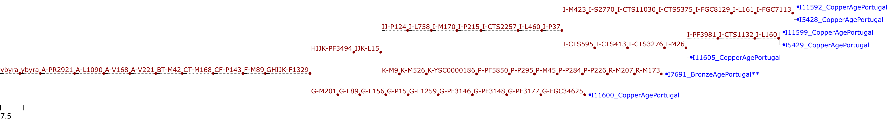

# ybyra example

A complete, ready-to-run example of ybyra on ancient DNA samples. All data needed to run it is included in this folder.

## Data

The `bams/` folder contains nine ancient Portuguese males from the Copper Age and Bronze Age, published in

> Olalde et al. (2019). The genomic history of the Iberian Peninsula over the past 8000 years.<br />
> *Science* 363(6432), 1230–1234. DOI:[10.1126/science.aav4040](https://doi.org/10.1126/science.aav4040)

These are 1240k capture data of half-UDG treated libraries, mapped to hg37. To keep the files small, we already extracted the Y chromosome from the published bam files (`samtools view <bam> Y`) and indexed them.

The `units.tsv` lists these samples, and `config.yaml` contains the settings for this example: hg37 with the FamilyTreeDNA tree, and the ancient DNA damage filter with the bidirectional damage model. All other settings are the defaults from `config/config.yaml`.

## Reference genome

ybyra needs the reference genome that the bam files are mapped to, here hs37d5 (hg37). As ybyra only uses the Y chromosome, the example ships with a reduced reference in `ref/`, containing only the Y chromosome, so that no large download is needed. This is for demonstration purposes only; for your own data, simply use the full reference genome that your bam files are mapped to.

We created the reduced reference from the full genome ([`hs37d5.genome.tgz` on Zenodo](https://zenodo.org/records/8045374)) as follows:

```
wget -O hs37d5.genome.tgz "https://zenodo.org/records/8045374/files/hs37d5.genome.tgz?download=1"
tar xzf hs37d5.genome.tgz
samtools faidx hs37d5/hs37d5.fa Y | bgzip > ref/hs37d5.Y.fa.gz
samtools faidx ref/hs37d5.Y.fa.gz
```

To run the example with the full reference genome instead, run the first two commands above within this `example/` folder, and set `ref_genome: "hs37d5/hs37d5.fa"` in `config.yaml`. The results are identical. Note that ybyra only needs the fasta file and its `.fai` index; no mapping index is needed.

## Run

Install the ybyra environment and activate it as described in the [main README](../README.md#requirements). Then, from the main ybyra directory, run:

```
snakemake --cores 4 --directory example
```

The results are written to this `example/` folder; see the [main README](../README.md#main-output-files) for a description of the output files.

## Expected results

The resulting `aggregate.yplace` should be identical to `expected_aggregate.yplace` in this folder, and `aggregate.pdf` should look like this:



Seven of the nine samples are placed in `aggregate.yplace`. Six of them are placed confidently (no flags, shown as `...`): five in haplogroup I (I-FGC7113, I-L160, I-M26) and one in G (G-FGC34625).

The low-coverage sample I7691 is only placed at R-M173, with a tree score of 16 (marked with `**` in the plot). Three nodes within R-M269 tie for the highest score, each supported by a single derived SNP (see `scoreties.yplace`). Their common ancestor R-M269 however fails the 5 step rule (see `step5nopass.yplace`), so the placement falls back to R-M173, hence the flags `tree_score_below_50;score_tie;most_recent_common_parent;step_rule`.

The two samples with the lowest coverage, I11604 and I7687, have a tree score below 10, and are hence not placed, but listed in `fail.yplace` instead.
